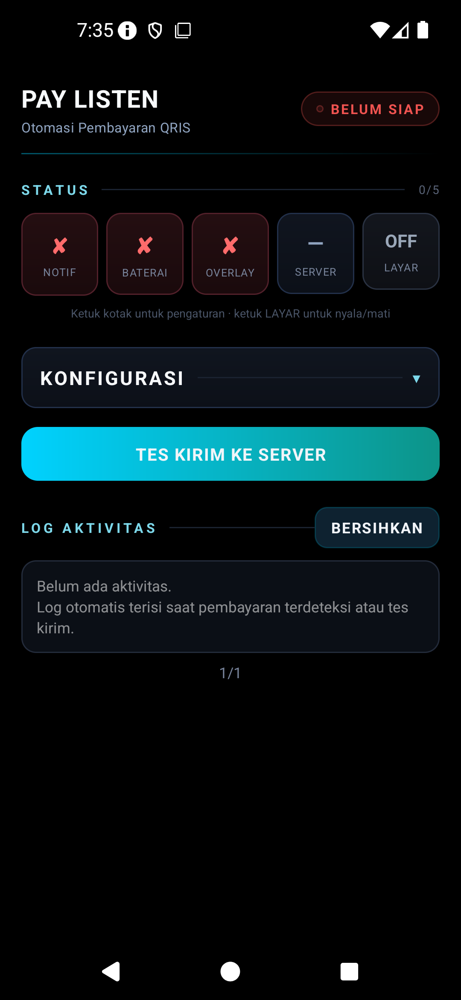
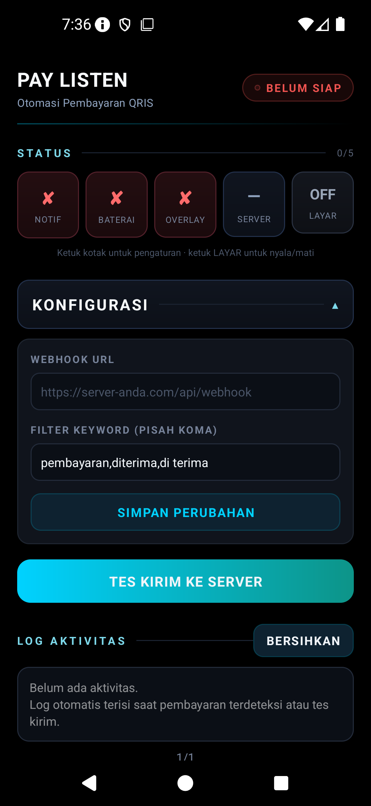

# 📡 PAY LISTEN

  

**Pendeteksi pembayaran QRIS otomatis untuk HP konter/warung** — merek **PAY LISTEN**.

App Android kecil yang berjalan di satu HP khusus untuk **menangkap notifikasi pembayaran masuk** (QRIS, DANA, OVO, GoPay, ShopeePay, dan e-wallet lain), membaca nominalnya, lalu **meneruskannya ke server via webhook**. Cocok untuk konter, warung, atau toko yang ingin saldo/deposit pelanggan masuk otomatis tanpa mengecek notifikasi satu per satu.

> 🌍 **Tanpa server default.** URL webhook diisi manual oleh admin di tiap HP — tiap HP bisa diarahkan ke server berbeda. Tidak ada alamat server yang di-hardcode di APK.

> 🔓 **Repo PUBLIK — bebas dipakai & dimodifikasi** (lisensi MIT). Tanpa kredensial, tanpa server default.

> 🤝 **Mau berkontribusi?** Baca [CONTRIBUTING.md](CONTRIBUTING.md) — fork, ubah, Pull Request. Lisensi: [LICENSE](LICENSE).

---

## ✨ Fitur

| Fitur | Deskripsi |
|-------|-----------|
| 🔔 **Pendeteksi notifikasi** | NotificationListenerService menangkap notif pembayaran, ekstrak nominal `Rp` |
| 🎯 **Filter keyword** | Hanya proses notif yang mengandung keyword (bisa diedit) |
| 🖥 **Layar selalu nyala** | Overlay + wake lock (ScreenOnService) agar notif selalu terbaca |
| 🔁 **Auto-start reboot** | BootReceiver — hidup lagi setelah HP restart |
| 💓 **Heartbeat** | Status HP ke `{base}/api/pay/heartbeat` tiap 10 menit (saat layar-nyala ON) |
| 🧪 **Tes Kirim** | POST ke URL yang diisi — cek koneksi tanpa efek |
| 📜 **Log aktivitas** | 50 riwayat terakhir, 5 per halaman |
| 🌙 **Tema gelap AMOLED** | Hemat baterai |
| 📱 **Android 15 siap** | Fix edge-to-edge (status bar tidak menutupi header) |

---

## ⚙️ ALUR KERJA APK (dari tangkap notif sampai hapus notif)

```
┌────────────────────────────────────────────────────────────────┐
│                    ① NOTIFIKASI MASUK                          │
│   E-wallet (QRIS/DANA/OVO/GoPay/ShopeePay) dapat notif         │
│   "ShopeePay: pembayaran diterima Rp 12.500"                   │
└──────────────────────────┬─────────────────────────────────────┘
                           ▼
┌────────────────────────────────────────────────────────────────┐
│              ② LISTENER MENANGKAP (PayListenListener)          │
│   NotificationListenerService membaca SEMUA notifikasi:        │
│   title + text → digabung jadi satu teks                       │
└──────────────────────────┬─────────────────────────────────────┘
                           ▼
┌────────────────────────────────────────────────────────────────┐
│                     ③ FILTER (2 lapis)                         │
│   Lapis 1: teks mengandung "Rp"?            → tidak = ABAIKAN  │
│   Lapis 2: teks mengandung keyword?         → tidak = ABAIKAN  │
│   (keyword default: pembayaran, diterima, di terima            │
│    — bisa diubah di KONFIGURASI; kosong = semua "Rp" diproses) │
└──────────────────────────┬─────────────────────────────────────┘
                           ▼
┌────────────────────────────────────────────────────────────────┐
│                  ④ EKSTRAK NOMINAL (regex)                     │
│   "pembayaran diterima Rp 12.500" → buang titik/koma → 12500   │
│   Bila tidak ada pola "Rp <angka>" → ABAIKAN                   │
└──────────────────────────┬─────────────────────────────────────┘
                           ▼
┌────────────────────────────────────────────────────────────────┐
│                  ⑤ KIRIM WEBHOOK (thread terpisah)             │
│   URL kosong?  → DILEWATI (log: "URL webhook kosong")          │
│   URL terisi?  → POST { "nominal":"12500", "message":"" }      │
│                 ke URL yang diisi admin                        │
│   Server balas 2xx  → log ✓ "Rp 12.500 — terkirim"             │
│   Balas 4xx/5xx/timeout → log ✘ (tidak ada retry otomatis)     │
└──────────────────────────┬─────────────────────────────────────┘
                           ▼
┌────────────────────────────────────────────────────────────────┐
│                 ⑥ HAPUS NOTIFIKASI (bersih)                    │
│   Setelah diproses → cancelNotification()                      │
│   Notif pembayaran DIHAPUS dari layar HP agar tidak            │
│   menumpuk & tidak diproses dua kali                          │
│   (notif lain — chat, dsb. — tidak pernah disentuh)            │
└──────────────────────────┬─────────────────────────────────────┘
                           ▼
┌────────────────────────────────────────────────────────────────┐
│              ⑦ CATAT RIWAYAT (LogStore)                        │
│   Setiap kejadian masuk log lokal (maks 50 baris):             │
│   "09/09 14:02:11  ✓ Rp 12.500 — terkirim (server 200)"        │
│   Tampil di app: LOG AKTIVITAS, 5 baris per halaman            │
└────────────────────────────────────────────────────────────────┘
```

### Fitur pendukung yang berjalan di latar:

| Komponen | Peran |
|----------|-------|
| **ScreenOnService** | Saat LAYAR ON: notifikasi "Layar Aktif" (foreground service) + wake lock + overlay titik kecil + **kirim heartbeat tiap 10 menit** ke `{base}/api/pay/heartbeat` (kalau URL terisi format `/api/..`) |
| **BootReceiver** | HP restart → baca status `screen_on` terakhir → kalau dulu ON, nyalakan lagi ScreenOnService otomatis |
| **Tes Kirim** | Tombol → POST `{"ts":...}` ke URL yang diisi → cek server hidup, tanpa efek apa pun |

### Ringkasan 1 kalimat:
> **Notif masuk → dicek "Rp"+keyword → nominal diekstrak → POST ke webhook server → notif dihapus → semua tercatat di log.**

---

## 📸 Tampilan

| Beranda | Konfigurasi | Status awal |
|---------|-------------|-------------|
|  |  |  |

---

## 🚀 Cara Pakai (singkat)

1. **Install APK** di HP Android 8.0+ khusus konter.
2. **Aktifkan izin** (ketuk tiap kotak sampai `✓`): NOTIF → Akses Notifikasi, BATERAI → bebas optimasi, OVERLAY → tampil di atas app lain, LAYAR → nyalakan (screen-on).
3. **Isi URL** di KONFIGURASI → **SIMPAN PERUBAHAN**.
4. Tekan **TES KIRIM** — muncul `✓ server merespon OK` bila server balas 2xx.
5. (Xiaomi/Vivo/Oppo) Aktifkan **Autostart** manual di pengaturan HP.

> 💡 URL kosong = app **diam total** (tidak kirim ke mana pun) — aman sampai diisi.

---

## 🔌 Callback yang Dikirim ke Server

### 1️⃣ Webhook pembayaran (utama)
```
POST {URL yang diisi}      Content-Type: application/json
{ "nominal": "12500", "message": "" }
```
- `nominal`: **string** angka tanpa titik (bisa `"0"` bila gagal baca)
- `message`: teks notifikasi (bisa kosong)
- Server wajib balas **2xx** → tercatat "terkirim"; 4xx/5xx/timeout → "gagal"

### 2️⃣ Tes kirim (tombol)
```
POST {URL yang diisi persis}      Content-Type: application/json
{ "ts": 1757388000000 }
```
- Cukup balas 2xx (body bebas).

### 3️⃣ Heartbeat (opsional, tiap 10 menit saat layar-nyala)
```
POST {base}/api/pay/heartbeat      Content-Type: application/json
{ "listener": true, "battery": true, "overlay": true, "screen": true, "batt": 87 }
```
- `{base}` = bagian URL **sebelum** `/api/` terakhir (mis. URL `https://saya.com/api/webhook` → heartbeat ke `https://saya.com/api/pay/heartbeat`)
- Opsional: tanpa endpoint ini, heartbeat gagal di log tapi webhook tetap jalan.

---

## 🧑‍💻 Contoh Penerima Server

### Endpoint yang dipakai server utama (`index.js` di STB):
```js
// Webhook QRIS — URL yang diisi di app
app.post('/api/webhook-qris', async (req, res) => {
  const { sender, nominal, message } = req.body;
  // cocokkan nominal dengan qris_pending → kredit saldo → generate voucher
  ...
});

// Tes — dipakai tombol tes (opsional)
app.post('/api/pay/test', (req, res) => res.json({ status:'ok' }));

// Heartbeat — dipantau App Admin
app.post('/api/pay/heartbeat', (req, res) => {
  fs.writeFileSync(PAY_STATUS_FILE, JSON.stringify({ ...req.body, lastSeen: Date.now() }));
  res.json({ status:'ok' });
});

// Status — dibaca App Admin (card Status PayListen)
app.get('/api/pay/status', authMiddleware, (req, res) => { ... });
```

### Penerima umum (PHP / Node / Python / Apps Script)
Lihat pola di bawah — cukup baca JSON `{nominal, message}` lalu balas 2xx:

```php
// webhook.php
$data = json_decode(file_get_contents("php://input"), true);
$nominal = (int)$data["nominal"];
// ... logika bisnis Anda ...
http_response_code(200);
echo json_encode(["status"=>"received"]);
```

```js
// Node.js (Express)
app.post("/webhook", (req, res) => {
  const { nominal, message } = req.body;
  // ... logika bisnis Anda ...
  res.json({ status: "received" });
});
```

```javascript
// Google Apps Script (doPost)
function doPost(e) {
  const d = JSON.parse(e.postData.contents);
  // ... tulis ke Sheet, kirim email, dll ...
  return ContentService.createTextOutput(JSON.stringify({status:"received"}))
    .setMimeType(ContentService.MimeType.JSON);
}
```

> ⚠️ GAS merespons POST dengan redirect 302 — sebagian klien tidak mengikutinya. Bila data masuk ke Sheet/email Anda, abaikan kode aneh di log tes.

---

## ✅ Checklist Server

| # | Syarat | Wajib? |
|---|--------|--------|
| 1 | URL publik (bukan localhost) | ✅ |
| 2 | HTTPS | ⭐ disarankan |
| 3 | Terima POST + baca JSON | ✅ |
| 4 | Balas 2xx | ✅ |
| 5 | Balas < 15 detik (timeout app) | ⭐ |
| 6 | Endpoint `/api/pay/heartbeat` | ➖ opsional |

---

## ❓ FAQ

- **Format balasan dituntut?** Tidak — cukup 2xx.
- **Nominal bisa salah baca?** Bisa. Validasi di server (cocokkan tagihan pending).
- **2 tagihan nominal sama?** Risiko sistem Anda — solusi: nominal unik per tagihan.
- **Retry bila gagal?** Tidak — gagal hanya tercatat di log. Pantau log berkala.
- **1 HP banyak server?** Tidak — 1 HP = 1 URL. Ganti URL + SIMPAN untuk pindah.
- **Data apa yang TIDAK dikirim?** SMS/kontak/lokasi tidak pernah. Hanya notif lolos filter.
- **Aman dari server palsu?** Endpoint Anda sendiri yang jaga (pakai URL token rahasia, mis. `?kunci=...`).

---

## 🛠️ Update / Ganti HP

- **Update**: install APK baru di atas lama — tanpa uninstall (signature sama), URL & keyword tetap.
- **Ganti HP**: setup ulang izin + URL (±2 menit).

---

## 🔧 Build

Repo ini hanya menyediakan **build debug** (tanpa signing release). Push ke `main` → GitHub Actions build otomatis → APK debug di **Artifacts**.

---

## 🛡️ Keamanan

- Tanpa server hardcoded; URL diisi manual per HP.
- Data lokal hanya di SharedPreferences HP.
- Endpoint server Anda sebaiknya dilindungi (URL token unik / cek header).
- Repo ini privat — kode tidak untuk disebar.

---

## 📦 Catatan Build

- `applicationId com.paylisten.app`, `minSdk 26`, `targetSdk 35`
- Versi terkini: **v2.0.0** (versionCode 16)
- Ikon radar — "mendeteksi uang masuk"
- Nama launcher: **PAY LISTEN**
